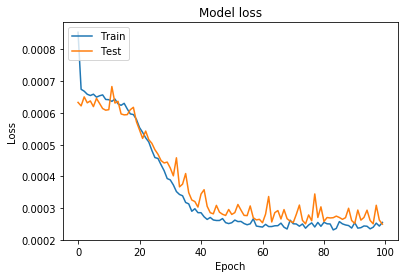
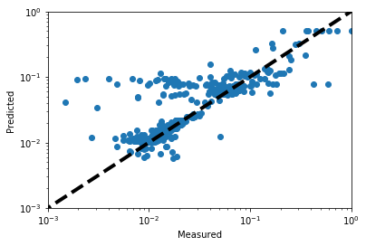
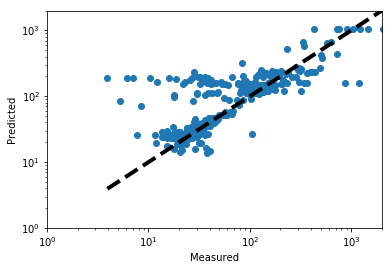

```python
import pandas as pd
import numpy as np
import logging 
import math

from sklearn.preprocessing import StandardScaler,MinMaxScaler,RobustScaler # to scale data
from sklearn.model_selection import train_test_split
from sklearn.metrics import roc_curve,roc_auc_score,accuracy_score

# NN model
import keras
from keras.models import Sequential
from keras.models import load_model
from keras.layers import Dense
from keras.optimizers import SGD #test keras

# for plotting
import matplotlib.pyplot as plt
import seaborn as sns


# machine learning model to predict the loss rate of the beam in the main collimators as a function of a set of operational parameters
# The loss rate is expressed through the IR7_lifetime variable (high IR7 lifetime = low loss rate)
# The input variables are retrieved from the CERN Logging Database, arranged in dataframes and saved in csv files in a separate notebook

```

    Using TensorFlow backend.


```python
pd.set_option('display.max_rows', 200)

train = True

# use logger for printouts
logging.basicConfig(level=logging.INFO)
logger = logging.getLogger()
```


```python
logger.info('Reading input files')
files = ["data/df_6772.csv","data/df_6909.csv"]
frames = []

# read input dataframes and print the structure of the first one. One column for each relevant variable.
for i,f in enumerate(files):
    frames.append(pd.read_csv(f))
    if i==0 :
        print('Printing head, columns and shape of first dataframe')
        print(frames[i].head())
        print(frames[i].columns)
        print(frames[i].shape)
```

    INFO:root:Reading input files


    Printing head, columns and shape of first dataframe
         Unnamed: 0  LifetimeB1  LifetimeB2  ATLASlumi  CMSlumi         IntB1  \
    0  1.528550e+09      13.398      17.711   0.000000      0.0  3.000000e+09   
    1  1.528550e+09      18.033      11.097   0.003093      0.0  2.817678e+14   
    2  1.528550e+09       9.961      11.613   0.006331      0.0  2.815667e+14   
    3  1.528550e+09       3.621      14.621   0.005287      0.0  2.813575e+14   
    4  1.528550e+09       6.193      20.903   0.007324      0.0  2.811533e+14   
    
              IntB2      Ene  Betastar_IP1  Betastar_IP5  Xing_IP1  Xing_IP5  \
    0 -4.100000e+08  54160.0          25.0          25.0     130.0     130.0   
    1  2.814936e+14   3755.0          25.0          25.0     130.0     130.0   
    2  2.812258e+14   3775.0          25.0          25.0     160.0     160.0   
    3  2.811517e+14   3815.0          25.0          25.0     160.0     160.0   
    4  2.810994e+14   3865.0          25.0          25.0     160.0     160.0   
    
       BMode  
    0    7.0  
    1    7.0  
    2    7.0  
    3    7.0  
    4    7.0  
    Index(['Unnamed: 0', 'LifetimeB1', 'LifetimeB2', 'ATLASlumi', 'CMSlumi',
           'IntB1', 'IntB2', 'Ene', 'Betastar_IP1', 'Betastar_IP5', 'Xing_IP1',
           'Xing_IP5', 'BMode'],
          dtype='object')
    (5388, 13)


```python
logger.info('Concatenating DataFrames')        
df = pd.concat(frames)
```

    INFO:root:Concatenating DataFrames


```python
# I want only beam mode >5 <12, i.e. between prepare energy ramp and stable beams (included)
# Below: list of beam mode codes as logged in the "HX:BMODE" timber variable
#setup 2
#injection probe beam 3
#injection setup beam 4
#injection physics beam 5
#prepare ramp 6
#ramp 7
#flat top 8
#squeeze 9
#adjust 10
#stable beams 11
#unstable beams 12
#beam dump 13
#ramp down 14
#recovery 15
#inject and dump 16
#circulate and dump 17
#abort 18
#cycling 19
#beam dump warning 20
#no beam 21
#prepare injection 22

logger.info("Cleaning beam mode: keep >5 and <12")
df = df[(df['BMode']>5) & (df['BMode']<12)]

logger.info('Converting DataFrame into np arrays')
X = df[['ATLASlumi', 'CMSlumi', 'IntB1', 'Ene', 'Betastar_IP1', 'Betastar_IP5', 'Xing_IP1','Xing_IP5', 'BMode']].values
y = df['LifetimeB1'].values
```

    INFO:root:Cleaning beam mode: keep >5 and <12
    INFO:root:Converting DataFrame into np arrays


```python
# scaling (necessary for the stability of the ML model)
logger.info('Scaling features')
sc = MinMaxScaler() # best scaler so far
#sc = RobustScaler()
#sc = StandardScaler()
X = sc.fit_transform(X)
y = y.reshape(-1,1) # arrange y vector in correct format
y = sc.fit_transform(y)
```

    INFO:root:Scaling features


```python
logger.info('Train and test splitting')
X_train,X_test,y_train,y_test = train_test_split(X,y,test_size = 0.3)
```

    INFO:root:Train and test splitting


```python
logger.info('Model definition and compilation')
model = Sequential() # creating model sequentially (each layer takes as input output of previous layer)
model.add(Dense(10, input_dim=9, activation='relu', kernel_initializer='normal')) # Dense: fully connected layer
model.add(Dense(80, activation='relu', kernel_initializer='normal'))
model.add(Dense(1, kernel_initializer='normal')) # to check: best activation function for single-value output
```

    INFO:root:Model definition and compilation


```python
# loss function and optimizer
model.compile(loss='mean_squared_error', optimizer='adam')
# training 
logger.info('Model training')
history = model.fit(X_train, y_train, epochs=100, batch_size=50, # 
                    validation_data = (X_test,y_test)) # show accuracy on test data after every epoch
# Prediction
y_pred = model.predict(X_test)
y_pred_train = model.predict(X_train)

model.save('models/my_model.h5')
```

    INFO:root:Model training


    Train on 11519 samples, validate on 4938 samples
    Epoch 1/100
    11519/11519 [==============================] - 1s 82us/step - loss: 8.5327e-04 - val_loss: 6.3284e-04
    Epoch 2/100
    11519/11519 [==============================] - 1s 72us/step - loss: 6.7395e-04 - val_loss: 6.2182e-04
    Epoch 3/100
    11519/11519 [==============================] - 1s 63us/step - loss: 6.6803e-04 - val_loss: 6.5008e-04
    Epoch 4/100
    11519/11519 [==============================] - 1s 68us/step - loss: 6.5837e-04 - val_loss: 6.3153e-04
    Epoch 5/100
    11519/11519 [==============================] - 1s 74us/step - loss: 6.5445e-04 - val_loss: 6.3741e-04
    Epoch 6/100
    11519/11519 [==============================] - 1s 72us/step - loss: 6.5858e-04 - val_loss: 6.1958e-04
    Epoch 7/100
    11519/11519 [==============================] - 1s 72us/step - loss: 6.4933e-04 - val_loss: 6.4537e-04
    Epoch 8/100
    11519/11519 [==============================] - 1s 73us/step - loss: 6.5362e-04 - val_loss: 6.2963e-04
    Epoch 9/100
    11519/11519 [==============================] - 1s 70us/step - loss: 6.5640e-04 - val_loss: 6.1354e-04
    Epoch 10/100
    11519/11519 [==============================] - 1s 71us/step - loss: 6.4210e-04 - val_loss: 6.0832e-04
    Epoch 11/100
    11519/11519 [==============================] - 1s 73us/step - loss: 6.4129e-04 - val_loss: 6.0994e-04
    Epoch 12/100
    11519/11519 [==============================] - 1s 73us/step - loss: 6.3603e-04 - val_loss: 6.8270e-04
    Epoch 13/100
    11519/11519 [==============================] - 1s 74us/step - loss: 6.4327e-04 - val_loss: 6.3082e-04
    Epoch 14/100
    11519/11519 [==============================] - 1s 73us/step - loss: 6.2838e-04 - val_loss: 6.3629e-04
    Epoch 15/100
    11519/11519 [==============================] - 1s 70us/step - loss: 6.2358e-04 - val_loss: 5.9651e-04
    Epoch 16/100
    11519/11519 [==============================] - 1s 74us/step - loss: 6.2992e-04 - val_loss: 5.9363e-04
    Epoch 17/100
    11519/11519 [==============================] - 1s 69us/step - loss: 6.1233e-04 - val_loss: 5.9435e-04
    Epoch 18/100
    11519/11519 [==============================] - 1s 73us/step - loss: 5.9665e-04 - val_loss: 6.0982e-04
    Epoch 19/100
    11519/11519 [==============================] - 1s 72us/step - loss: 5.9463e-04 - val_loss: 6.1741e-04
    Epoch 20/100
    11519/11519 [==============================] - 1s 74us/step - loss: 5.7918e-04 - val_loss: 5.7182e-04
    Epoch 21/100
    11519/11519 [==============================] - 1s 72us/step - loss: 5.5373e-04 - val_loss: 5.4627e-04
    Epoch 22/100
    11519/11519 [==============================] - 1s 74us/step - loss: 5.3874e-04 - val_loss: 5.1966e-04
    Epoch 23/100
    11519/11519 [==============================] - 1s 71us/step - loss: 5.2150e-04 - val_loss: 5.4271e-04
    Epoch 24/100
    11519/11519 [==============================] - 1s 74us/step - loss: 5.0855e-04 - val_loss: 5.1576e-04
    Epoch 25/100
    11519/11519 [==============================] - 1s 71us/step - loss: 4.8227e-04 - val_loss: 5.0436e-04
    Epoch 26/100
    11519/11519 [==============================] - 1s 71us/step - loss: 4.5951e-04 - val_loss: 4.8413e-04
    Epoch 27/100
    11519/11519 [==============================] - 1s 73us/step - loss: 4.5663e-04 - val_loss: 4.6982e-04
    Epoch 28/100
    11519/11519 [==============================] - 1s 72us/step - loss: 4.3684e-04 - val_loss: 4.5012e-04
    Epoch 29/100
    11519/11519 [==============================] - 1s 61us/step - loss: 4.1831e-04 - val_loss: 4.4251e-04
    Epoch 30/100
    11519/11519 [==============================] - 1s 56us/step - loss: 3.9351e-04 - val_loss: 4.4523e-04
    Epoch 31/100
    11519/11519 [==============================] - 1s 56us/step - loss: 3.8928e-04 - val_loss: 4.2668e-04
    Epoch 32/100
    11519/11519 [==============================] - 1s 54us/step - loss: 3.7344e-04 - val_loss: 4.0208e-04
    Epoch 33/100
    11519/11519 [==============================] - 1s 59us/step - loss: 3.5261e-04 - val_loss: 4.5874e-04
    Epoch 34/100
    11519/11519 [==============================] - 1s 52us/step - loss: 3.4348e-04 - val_loss: 3.6748e-04
    Epoch 35/100
    11519/11519 [==============================] - 1s 58us/step - loss: 3.3941e-04 - val_loss: 3.7599e-04
    Epoch 36/100
    11519/11519 [==============================] - 1s 55us/step - loss: 3.1834e-04 - val_loss: 4.0929e-04
    Epoch 37/100
    11519/11519 [==============================] - 1s 56us/step - loss: 3.1393e-04 - val_loss: 3.4924e-04
    Epoch 38/100
    11519/11519 [==============================] - 1s 56us/step - loss: 2.9072e-04 - val_loss: 3.2615e-04
    Epoch 39/100
    11519/11519 [==============================] - 1s 58us/step - loss: 2.9873e-04 - val_loss: 3.2122e-04
    Epoch 40/100
    11519/11519 [==============================] - 1s 55us/step - loss: 2.8627e-04 - val_loss: 3.0388e-04
    Epoch 41/100
    11519/11519 [==============================] - 1s 57us/step - loss: 2.8618e-04 - val_loss: 3.4465e-04
    Epoch 42/100
    11519/11519 [==============================] - 1s 57us/step - loss: 2.7338e-04 - val_loss: 3.5850e-04
    Epoch 43/100
    11519/11519 [==============================] - 1s 58us/step - loss: 2.6509e-04 - val_loss: 3.0633e-04
    Epoch 44/100
    11519/11519 [==============================] - 1s 58us/step - loss: 2.7130e-04 - val_loss: 2.8626e-04
    Epoch 45/100
    11519/11519 [==============================] - 1s 58us/step - loss: 2.6339e-04 - val_loss: 2.8263e-04
    Epoch 46/100
    11519/11519 [==============================] - 1s 57us/step - loss: 2.6173e-04 - val_loss: 3.0921e-04
    Epoch 47/100
    11519/11519 [==============================] - 1s 59us/step - loss: 2.6176e-04 - val_loss: 2.8789e-04
    Epoch 48/100
    11519/11519 [==============================] - 1s 58us/step - loss: 2.6773e-04 - val_loss: 2.8126e-04
    Epoch 49/100
    11519/11519 [==============================] - 1s 55us/step - loss: 2.5498e-04 - val_loss: 2.7749e-04
    Epoch 50/100
    11519/11519 [==============================] - 1s 61us/step - loss: 2.5203e-04 - val_loss: 2.9635e-04
    Epoch 51/100
    11519/11519 [==============================] - 1s 69us/step - loss: 2.5478e-04 - val_loss: 2.8071e-04
    Epoch 52/100
    11519/11519 [==============================] - 1s 58us/step - loss: 2.6301e-04 - val_loss: 2.8651e-04
    Epoch 53/100
    11519/11519 [==============================] - 1s 56us/step - loss: 2.5836e-04 - val_loss: 3.1202e-04
    Epoch 54/100
    11519/11519 [==============================] - 1s 75us/step - loss: 2.5878e-04 - val_loss: 2.9439e-04
    Epoch 55/100
    11519/11519 [==============================] - 1s 70us/step - loss: 2.5219e-04 - val_loss: 2.7778e-04
    Epoch 56/100
    11519/11519 [==============================] - 1s 72us/step - loss: 2.4834e-04 - val_loss: 2.7701e-04
    Epoch 57/100
    11519/11519 [==============================] - 1s 73us/step - loss: 2.5122e-04 - val_loss: 3.0747e-04
    Epoch 58/100
    11519/11519 [==============================] - 1s 71us/step - loss: 2.6701e-04 - val_loss: 2.7033e-04
    Epoch 59/100
    11519/11519 [==============================] - 1s 72us/step - loss: 2.4428e-04 - val_loss: 2.6361e-04
    Epoch 60/100
    11519/11519 [==============================] - 1s 72us/step - loss: 2.4255e-04 - val_loss: 2.6537e-04
    Epoch 61/100
    11519/11519 [==============================] - 1s 72us/step - loss: 2.4105e-04 - val_loss: 2.5464e-04
    Epoch 62/100
    11519/11519 [==============================] - 1s 72us/step - loss: 2.4956e-04 - val_loss: 2.8170e-04
    Epoch 63/100
    11519/11519 [==============================] - 1s 74us/step - loss: 2.4267e-04 - val_loss: 3.3708e-04
    Epoch 64/100
    11519/11519 [==============================] - 1s 73us/step - loss: 2.4272e-04 - val_loss: 2.5715e-04
    Epoch 65/100
    11519/11519 [==============================] - 1s 74us/step - loss: 2.4511e-04 - val_loss: 2.8635e-04
    Epoch 66/100
    11519/11519 [==============================] - 1s 73us/step - loss: 2.4545e-04 - val_loss: 2.9290e-04
    Epoch 67/100
    11519/11519 [==============================] - 1s 74us/step - loss: 2.5340e-04 - val_loss: 2.6651e-04
    Epoch 68/100
    11519/11519 [==============================] - 1s 74us/step - loss: 2.4061e-04 - val_loss: 2.9602e-04
    Epoch 69/100
    11519/11519 [==============================] - 1s 76us/step - loss: 2.3499e-04 - val_loss: 2.6738e-04
    Epoch 70/100
    11519/11519 [==============================] - 1s 73us/step - loss: 2.6264e-04 - val_loss: 2.5956e-04
    Epoch 71/100
    11519/11519 [==============================] - 1s 75us/step - loss: 2.5150e-04 - val_loss: 2.5514e-04
    Epoch 72/100
    11519/11519 [==============================] - 1s 71us/step - loss: 2.5069e-04 - val_loss: 2.8108e-04
    Epoch 73/100
    11519/11519 [==============================] - 1s 76us/step - loss: 2.4382e-04 - val_loss: 3.1020e-04
    Epoch 74/100
    11519/11519 [==============================] - 1s 72us/step - loss: 2.5081e-04 - val_loss: 2.6208e-04
    Epoch 75/100
    11519/11519 [==============================] - 1s 75us/step - loss: 2.3750e-04 - val_loss: 2.5118e-04
    Epoch 76/100
    11519/11519 [==============================] - 1s 72us/step - loss: 2.4745e-04 - val_loss: 2.7911e-04
    Epoch 77/100
    11519/11519 [==============================] - 1s 73us/step - loss: 2.5425e-04 - val_loss: 2.6083e-04
    Epoch 78/100
    11519/11519 [==============================] - 1s 72us/step - loss: 2.4131e-04 - val_loss: 3.4516e-04
    Epoch 79/100
    11519/11519 [==============================] - 1s 65us/step - loss: 2.5559e-04 - val_loss: 2.7116e-04
    Epoch 80/100
    11519/11519 [==============================] - 1s 67us/step - loss: 2.4347e-04 - val_loss: 3.0461e-04
    Epoch 81/100
    11519/11519 [==============================] - 1s 68us/step - loss: 2.5610e-04 - val_loss: 2.5879e-04
    Epoch 82/100
    11519/11519 [==============================] - 1s 75us/step - loss: 2.5134e-04 - val_loss: 2.7108e-04
    Epoch 83/100
    11519/11519 [==============================] - 1s 75us/step - loss: 2.5081e-04 - val_loss: 2.6969e-04
    Epoch 84/100
    11519/11519 [==============================] - 1s 75us/step - loss: 2.3211e-04 - val_loss: 2.7051e-04
    Epoch 85/100
    11519/11519 [==============================] - 1s 70us/step - loss: 2.3678e-04 - val_loss: 2.7548e-04
    Epoch 86/100
    11519/11519 [==============================] - 1s 74us/step - loss: 2.5827e-04 - val_loss: 2.7115e-04
    Epoch 87/100
    11519/11519 [==============================] - 1s 73us/step - loss: 2.5113e-04 - val_loss: 2.6539e-04
    Epoch 88/100
    11519/11519 [==============================] - 1s 76us/step - loss: 2.4771e-04 - val_loss: 2.7052e-04
    Epoch 89/100
    11519/11519 [==============================] - 1s 74us/step - loss: 2.4580e-04 - val_loss: 3.0018e-04
    Epoch 90/100
    11519/11519 [==============================] - 1s 72us/step - loss: 2.3794e-04 - val_loss: 2.6161e-04
    Epoch 91/100
    11519/11519 [==============================] - 1s 72us/step - loss: 2.5480e-04 - val_loss: 2.5242e-04
    Epoch 92/100
    11519/11519 [==============================] - 1s 71us/step - loss: 2.3771e-04 - val_loss: 2.9458e-04
    Epoch 93/100
    11519/11519 [==============================] - 1s 74us/step - loss: 2.3913e-04 - val_loss: 2.6288e-04
    Epoch 94/100
    11519/11519 [==============================] - 1s 72us/step - loss: 2.4455e-04 - val_loss: 2.7123e-04
    Epoch 95/100
    11519/11519 [==============================] - 1s 73us/step - loss: 2.4362e-04 - val_loss: 2.9413e-04
    Epoch 96/100
    11519/11519 [==============================] - 1s 71us/step - loss: 2.3551e-04 - val_loss: 2.6195e-04
    Epoch 97/100
    11519/11519 [==============================] - 1s 70us/step - loss: 2.4056e-04 - val_loss: 2.5129e-04
    Epoch 98/100
    11519/11519 [==============================] - 1s 79us/step - loss: 2.5339e-04 - val_loss: 3.0959e-04
    Epoch 99/100
    11519/11519 [==============================] - 1s 78us/step - loss: 2.4420e-04 - val_loss: 2.6297e-04
    Epoch 100/100
    11519/11519 [==============================] - 1s 74us/step - loss: 2.5564e-04 - val_loss: 2.5023e-04


```python
'''
logger.info('Plotting accuracy')
plt.plot(history.history['acc'])
plt.plot(history.history['val_acc'])
plt.title('Model acc')
plt.ylabel('Accuracy')
plt.xlabel('Epoch')
plt.legend(['Train', 'Test'], loc='upper left')
plt.show()
'''
```


    "\nlogger.info('Plotting accuracy')\nplt.plot(history.history['acc'])\nplt.plot(history.history['val_acc'])\nplt.title('Model acc')\nplt.ylabel('Accuracy')\nplt.xlabel('Epoch')\nplt.legend(['Train', 'Test'], loc='upper left')\nplt.show()\n"


```python
logger.info('Plotting loss function')
plt.plot(history.history['loss']) 
plt.plot(history.history['val_loss']) 
plt.title('Model loss') 
plt.ylabel('Loss') 
plt.xlabel('Epoch') 
plt.legend(['Train', 'Test'], loc='upper left') 
plt.show()
```

    INFO:root:Plotting loss function





```python
# reasonable correlation between predicted and measured IR7 lifetime (here shown before inverse scaling)
# shows that there is potential to predict instantaneous beam loss rate from operational parameters, through a dedicated neural network
# non-linearities are still present, indicating that the model can be further improved

logger.info('Plotting predictions before inverse scaling')
fig, ax = plt.subplots()
ax.scatter(y_test, y_pred)
ax.plot([y_test.min(), y_test.max()], [y_test.min(), y_test.max()], 'k--', lw=4)
ax.set_xlabel('Measured')
ax.set_ylabel('Predicted')
plt.yscale('log')
plt.xscale('log')
plt.ylim(1e-3,1)
plt.xlim(1e-3,1)
plt.show()
```

    INFO:root:Plotting predictions before inverse scaling





```python
y_test = sc.inverse_transform(y_test)
y_pred = sc.inverse_transform(y_pred)

logger.info('Plotting predictions after inverse scaling')
fig, ax = plt.subplots()
ax.scatter(y_test, y_pred)
ax.plot([y_test.min(), y_test.max()], [y_test.min(), y_test.max()], 'k--', lw=4)
ax.set_xlabel('Measured')
ax.set_ylabel('Predicted')
plt.yscale('log')
plt.xscale('log')
plt.ylim(1,2000)
plt.xlim(1,2000)
plt.show()
```

    INFO:root:Plotting predictions after inverse scaling





```python

```
